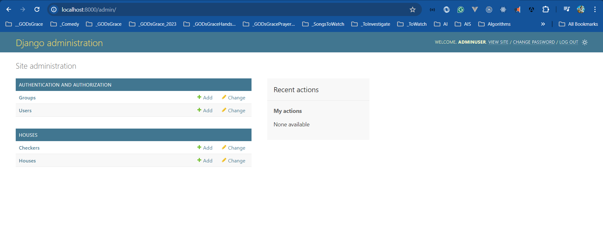

# Houses Application

I am learning to create Houses App using Python Django, and ReactJS

> 1. <https://www.cloudamqp.com/>
> 1. <http://localhost:3000/config/houses>

```powershell
docker network create housesappnetwork
```

## Backend - Config

> 1. To be done

```powershell
python -m venv .venv
.\.venv\Scripts\activate
python.exe -m pip install --upgrade pip

pip install django
pip install djangorestframework
pip install flask

django-admin startproject config
python manage.py runserver

python manage.py migrate

pip install mysqlclient
pip install pika
pip install django-mysql
pip install django-cors-headers

pip freeze > .\requirements.txt
pip install –r requirements.txt

docker build --pull --rm -f "Dockerfile" -t housesservices:latest -t vishipayyallore/housesservices:latest .
```

## Backend - Houses App

```powershell
docker-compose exec backend sh

django-admin startapp houses

python manage.py makemigrations

python manage.py migrate
```




## Backend - Core Services

```powershell
pip install Flask Flask-SQLAlchemy SQLAlchemy Flask-Migrate Flask-Script Flask-Cors
pip install requests mysqlclient markupsafe itsdangerous jinja2 werkzeug pika pytz

docker build --pull --rm -f "Dockerfile" -t coreservices:latest -t vishipayyallore/coreservices:latest .

docker-compose exec backend sh

flask db init
flask db migrate -m "Your message here"
flask db upgrade
flask db downgrade
```

## Frontend

> 1. To be done

```powershell
npx create-react-app housesweb --template typescript
```

## Appendix A

```python
# config/settings.py
from dotenv import load_dotenv

# Load environment variables from .env file
load_dotenv()
```


curl -v http://housesservices-backend-1:8000/api/houses
curl -v http://localhost:8000/api/houses
curl -v http://housesservices-backend-1:8000/api/checker